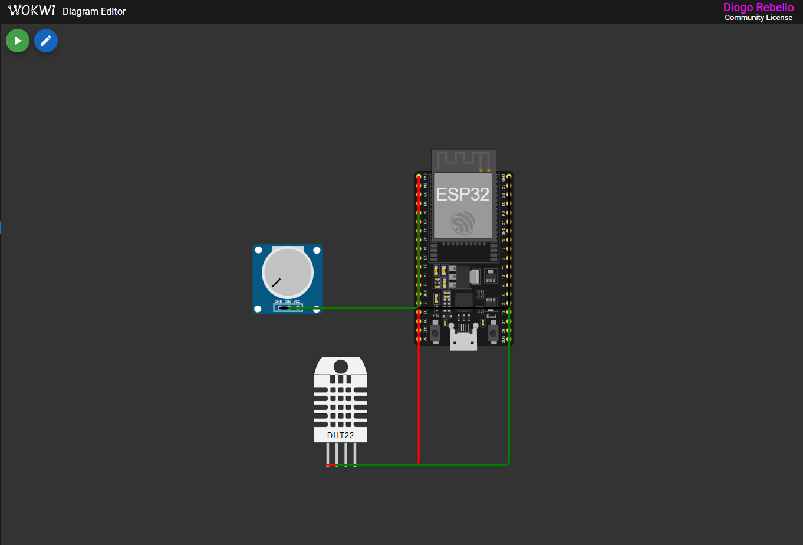
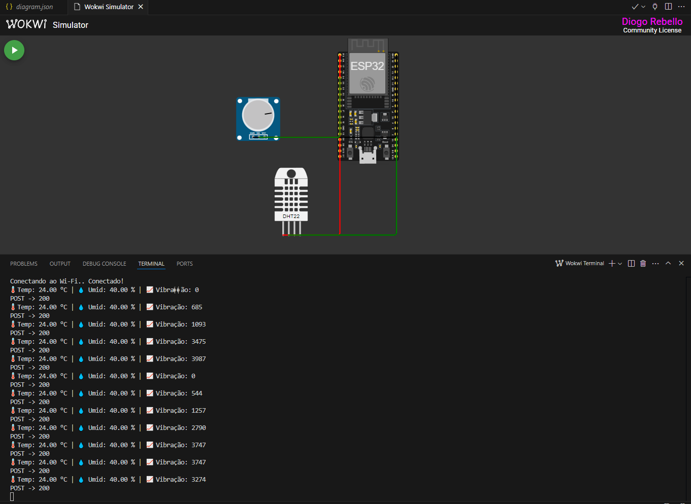
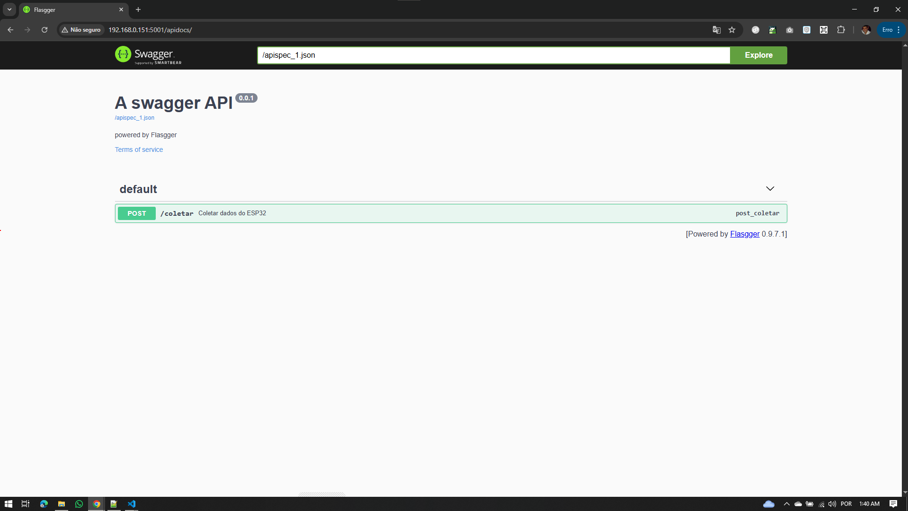
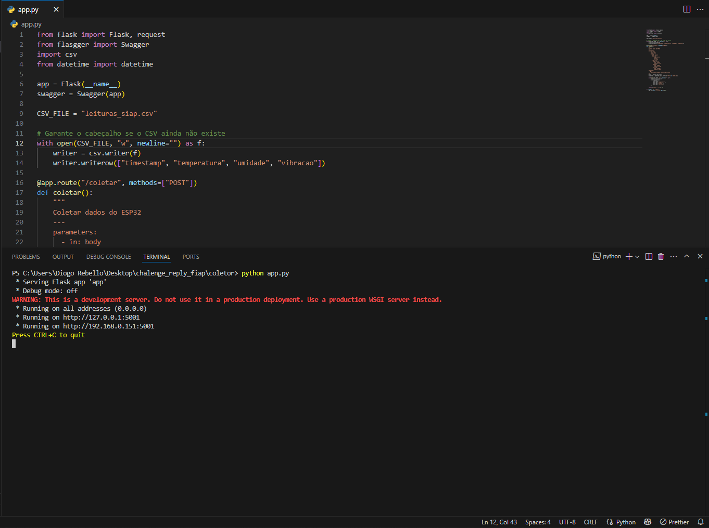
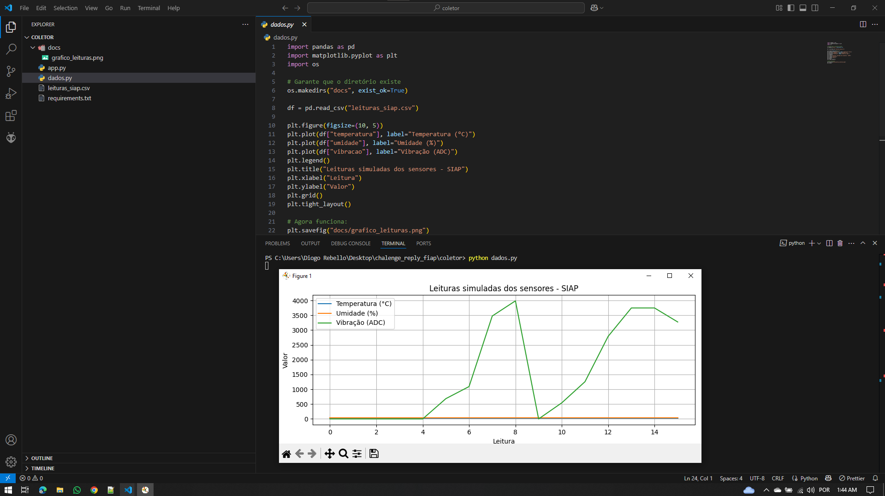

# CHALLENGE REPLY - FASE 2

**Sistema Inteligente de Análise Preditiva (SIAP) - Fase 2**

Esse projeto segue a arquitetura que foi feita na Fase 1, presente no repositório:

[https://github.com/drdosan/chalenge_reply_fiap](https://github.com/drdosan/chalenge_reply_fiap)

---

## 📅 Etapas do Projeto

O projeto foi estruturado em três módulos principais:

1. **Coleta de Dados com ESP32 (simulação no Wokwi)**
2. **API em Python com Flask para registrar os dados**
3. **Análise gráfica com Matplotlib para gerar insights**

### Ordem recomendada de execução:

1. Subir a API Flask
2. Rodar o projeto dos sensores (Wokwi ou PlatformIO)
3. Executar a análise gráfica com `dados.py`

---

## 🛠️ 1. Coleta de Dados (ESP32 + Sensores)

### Sensores utilizados e justificativa:

* **DHT22**: sensor de temperatura e umidade amplamente utilizado em sistemas industriais e agrícolas.
* **Potenciômetro**: simula um sensor analógico de vibração, representando falhas mecânicas.

### Circuito e simulação:

O circuito foi criado no **Wokwi** com ESP32 DevKit-C v4.



### Leitura dos dados na simulação:

O código `main.ino` lê os dados dos sensores e os imprime no Monitor Serial:

```cpp
float temperatura = dht.readTemperature();
float umidade = dht.readHumidity();
int vibracao = analogRead(POTPIN);

Serial.print("Temp: "); Serial.println(temperatura);
```

### Registro do funcionamento (Monitor Serial):



---

## 💡 2. API de Coleta de Dados (Flask)

### Objetivo:

Receber os dados dos sensores via HTTP POST e salvar em um arquivo `.csv`.

### Como executar:

```bash
cd coletor
pip install -r requirements.txt
python app.py
```

A API estará disponível em:

```
http://192.168.0.151:5001/coletar
```

### Documentação via Swagger:

```
http://192.168.0.151:5001/apidocs
```

#### Evidências de funcionamento da API:




### Justificativa técnica para uso da API

Além dos benefícios arquiteturais, o uso da API também se mostrou essencial devido a uma limitação técnica da plataforma Wokwi Web. Por ser uma simulação baseada em navegador, o Wokwi não permite acesso direto ao monitor serial por código externo nem integração direta com scripts Python. Dessa forma, a API serviu como único meio viável de capturar os dados simulados de forma estruturada, possibilitando o registro e análise posterior via .csv.

O uso de uma API REST no projeto SIAP visa simular uma arquitetura moderna e escalável para a coleta de dados em tempo real, refletindo práticas adotadas em sistemas industriais reais. Essa abordagem oferece diversos benefícios técnicos:

* **Desacoplamento entre coleta e persistência**: separa a lógica de leitura no dispositivo da lógica de armazenamento e processamento.
* **Persistência estruturada**: registra os dados em `.csv`, simulando integração com banco de dados.
* **Escalabilidade**: permite que múltiplos dispositivos enviem dados para o mesmo backend.
* **Validação com Swagger**: facilita o teste e a compreensão das requisições realizadas.
* **Simulação fiel de um pipeline real**: mesmo sem hardware, recria o fluxo de coleta, envio e análise.


---

## 🌐 3. Análise Gráfica (Python + Matplotlib)

### Objetivo:

Ler o arquivo `leituras_siap.csv` e gerar um gráfico com as medições coletadas.

### Como executar:

```bash
cd coletor
python dados.py
```

> Obs: o diretório `docs/` será criado automaticamente, se não existir.

### Gráfico gerado:



---

## 📁 Estrutura do Projeto

```
CHALLENGE_REPLY_FIAP_FASE2/
├── sensores/
│   ├── src/main.ino
│   ├── diagram.json
│   ├── platformio.ini
│   └── docs/simulacao_esp32.png
├── coletor/
│   ├── app.py
│   ├── dados.py
│   ├── leituras_siap.csv
│   ├── requirements.txt
│   └── docs/grafico_leituras.png
├── img/
│   ├── sensores.png
│   ├── api.png
│   ├── api_swagger.png
│   └── analise_grafica_dados.png
├── README.md
└── SIAP.drawio.png
```

---

## 🧑‍🤝‍🧑 Membros do Grupo

| Matrícula                 | Aluno               						  |
|---------------------------|---------------------------------------------|
|        RM 565150          | Andre de Oliveira Santos Burger			  |
|        RM 565497          | Vera Maria Chaves de Souza				  | 
|        RM 565286          | Diogo Rebello dos Santos					  |
|        RM 565555          | Marcos Vinícius dos Santos Fernandes		  |

---

## 🚀 Considerações finais

* Todas as etapas propostas foram contempladas com sucesso.
* O projeto simula com fidelidade o fluxo de coleta e análise de dados baseado em sensores.
* A estrutura permite expansão futura para dashboards, banco de dados e alertas em tempo real.
